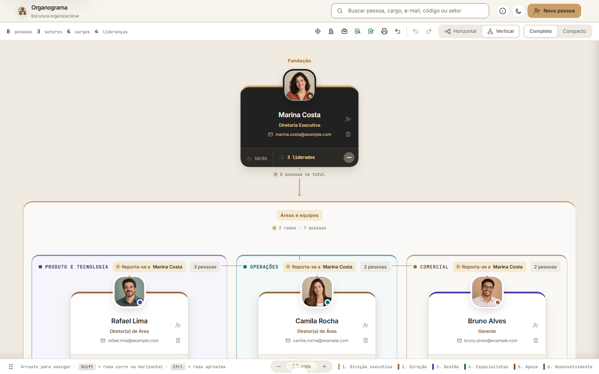
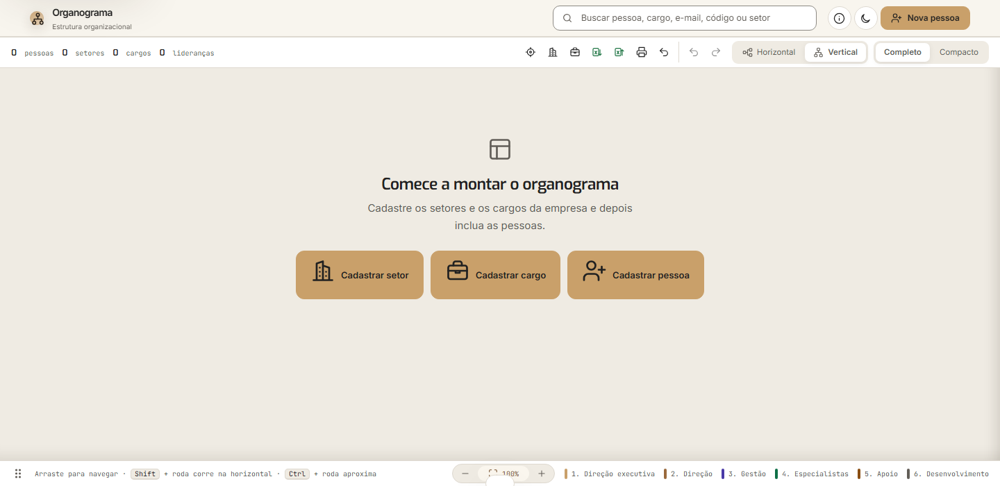
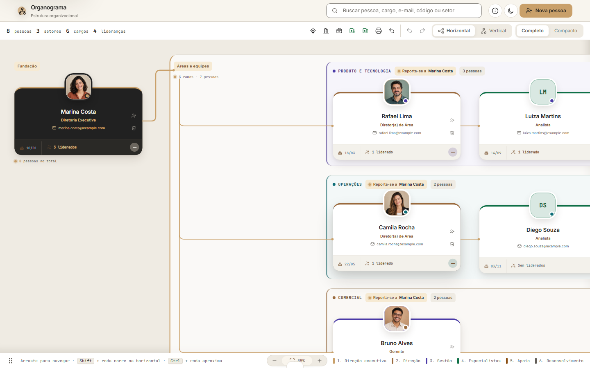
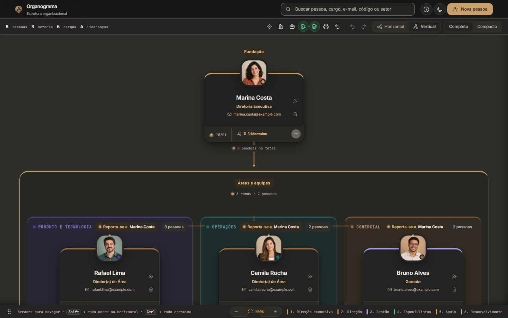

<div align="center">

# Organograma

**Sua estrutura organizacional, clara como deveria ser.**
Monte, navegue e mantenha o organograma da sua empresa direto no navegador — sem servidor, sem cadastro, sem mensalidade e sem enviar um único dado para fora.




</div>

---

## O problema

Todo organograma nasce bonito e envelhece mal. Ele vive num slide, num PDF ou numa planilha que ninguém abre — e no dia em que alguém muda de área, ele já está errado.

Ferramentas de organograma "de verdade" resolvem isso cobrando por usuário, exigindo login e guardando o quadro de pessoas da sua empresa em servidores de terceiros.

## A ideia

Um organograma que **se desenha sozinho a partir de quem responde a quem**.

Você cadastra pessoas, cargos e setores. Cada pessoa aponta para o seu gestor. O resto — posição, hierarquia, linhas de ligação, cores, recolhimento de equipes — é calculado na hora. Mudou alguém de área? Troque o campo **Reporta-se a** e o desenho se refaz.

E tudo isso roda **só no seu navegador**.

---

## Comece em um minuto

Na primeira abertura o organograma está em branco, sem dados de exemplo para apagar. Um guia de três passos leva você até o primeiro resultado:

<p align="center">
  
</p>

1. **Cadastrar setor** — nome, descrição e uma cor de identificação.
2. **Cadastrar cargo** — com o nível hierárquico sugerido.
3. **Cadastrar pessoa** — foto, contato, aniversário e a quem ela se reporta.

Já tem tudo numa planilha? Importe o `.xlsx` e o organograma inteiro aparece de uma vez.

---

## O que você ganha

### Uma hierarquia que se lê de relance

- **Vertical ou horizontal.** Da fundação para baixo ou da esquerda para a direita. A escolha fica salva.
- **Setores com identidade própria.** Cada área tem sua cor, agrupa suas equipes e mostra quantas pessoas reúne.
- **Seis níveis de leitura.** Direção executiva, Direção, Gestão, Especialistas, Apoio e Desenvolvimento, cada um com sua marca visual no card.
- **Linhas que dizem a verdade.** Traço sólido mostra a hierarquia dentro do mesmo bloco; traço tracejado mostra quem responde a um gestor de **outro setor**. As linhas passam por trás de títulos e cards em vez de cruzar o que você precisa ler.

<p align="center">
  
</p>

### Navegação que respeita seu tempo

- **Recolher e expandir equipes** com um clique, com animação fluida. A estrutura escondida continua contada e nada se perde.
- **Busca instantânea** por nome, cargo, e-mail, código, setor ou nível — com contagem de resultados e salto entre ocorrências (`/` ou `Ctrl + K` levam ao campo).
- **Zoom de 50% a 140%**, ajuste automático à tela e arrastar para navegar.
- **Modo Completo ou Compacto**, para ver rostos e contatos ou só a estrutura.

### Edição sem medo

- **Desfazer e refazer** para qualquer alteração.
- **Gerenciar setores e cargos** em catálogos próprios — inclusive os que ainda não têm ninguém.
- **Foto do colaborador** recortada e otimizada no próprio navegador.
- **E-mail com atalho** direto no card e **aniversários** cadastrados.

### Pronto para o dia a dia

- **Excel nos dois sentidos.** Exporte para backup ou para o RH; importe para atualizar em lote.
- **Impressão e PDF** com layout preparado para papel.
- **Tema claro e escuro**, lembrado entre as visitas.
- **Funciona no celular.** Em telas estreitas o quadro vira uma lista em árvore, com menus e diálogos ajustados ao toque.

<p align="center">
  
</p>

<p align="center">
  
</p>

---

## Para quem é

- **RH e People** que precisam de um organograma sempre atual, sem depender de design.
- **Fundadores e gestores** de empresas em crescimento que querem clareza de reporte hoje, não numa próxima reestruturação.
- **Consultorias e contabilidades** que montam a estrutura de vários clientes e entregam o resultado em Excel ou PDF.
- **Times de TI e segurança** que não aceitam levar dados de pessoal para uma plataforma externa.

---

## Privacidade de ponta a ponta

O Organograma é **local-first**: não existe backend.

- Pessoas, cargos, setores, fotos e preferências ficam no `localStorage` do **seu navegador**.
- Nenhum dado é coletado, monitorado ou enviado a servidores ou serviços de telemetria.
- Você é dono do backup: exporte a planilha `.xlsx` quando quiser e leve a estrutura para onde precisar.

> Como os dados moram no navegador, limpar os dados do site apaga o organograma. Exporte a planilha para guardar uma cópia.

---

## Como rodar

Não há build, instalador nem dependência. Você só precisa de um navegador moderno.

**Opção 1 — abrir direto.** Dê dois cliques em `index.html`.

**Opção 2 — servidor local incluso** (recomendado). Requer [Node.js](https://nodejs.org) 18 ou superior:

```bash
npm start
```

Depois acesse **http://127.0.0.1:4173**. Para usar outra porta:

```bash
# Linux / macOS
PORT=4200 npm start

# Windows (PowerShell)
$env:PORT=4200; npm start
```

### Publicar na web

Por ser um site estático, qualquer hospedagem serve: GitHub Pages, Netlify, Cloudflare Pages ou um servidor de arquivos comum. Basta publicar `index.html`, `app.js`, `styles.css` e as pastas `assets/` e `data/`.

---

## Planilha Excel

O modelo de referência está em [`data/modelo-organograma.xlsx`](data/modelo-organograma.xlsx).

| Coluna | Descrição |
| :--- | :--- |
| `Código` | Matrícula ou identificador interno do colaborador |
| `ID Pessoa` | Identificador único da pessoa |
| `Nome` | Nome completo |
| `E-mail` | Endereço corporativo |
| `Aniversário` | Data no formato `DD/MM` |
| `Setor` | Departamento ou área |
| `Cargo` | Título da função |
| `ID Cargo` | Chave de ligação com o catálogo de cargos |
| `Nível (1 a 6)` | Escala de hierarquia, de Direção executiva a Desenvolvimento |
| `Núcleo ou equipe` | Subdivisão interna, projeto ou squad |
| `Reporta-se a` | Nome do gestor imediato |
| `ID Gestor` | Identificador do gestor |
| `Ordem` | Ordem preferida de exibição |

> Para que a hierarquia seja reconstruída corretamente, mantenha a correspondência entre `ID Pessoa`, `ID Cargo` e `ID Gestor`.

---

## Estrutura do projeto

```text
organograma/
├── index.html       Estrutura da página, diálogos e ícones
├── styles.css       Design system, temas claro/escuro e layout responsivo
├── app.js           Estado, cálculo da hierarquia, linhas de ligação e Excel
├── assets/          Imagens do projeto e retratos usados nos exemplos
├── data/            Planilha modelo para importação
└── scripts/
    └── serve.mjs    Servidor local sem dependências (npm start)
```

HTML, CSS e JavaScript puros — nenhum framework, nenhum bundler, nenhuma dependência de runtime.

---

## Estado atual

Versão **2.0.0**. Se algo se comportar de forma inesperada, o melhor relato inclui a largura da tela, se a orientação era vertical ou horizontal e, se possível, uma exportação da planilha que reproduza o problema (sem dados reais de pessoas).
